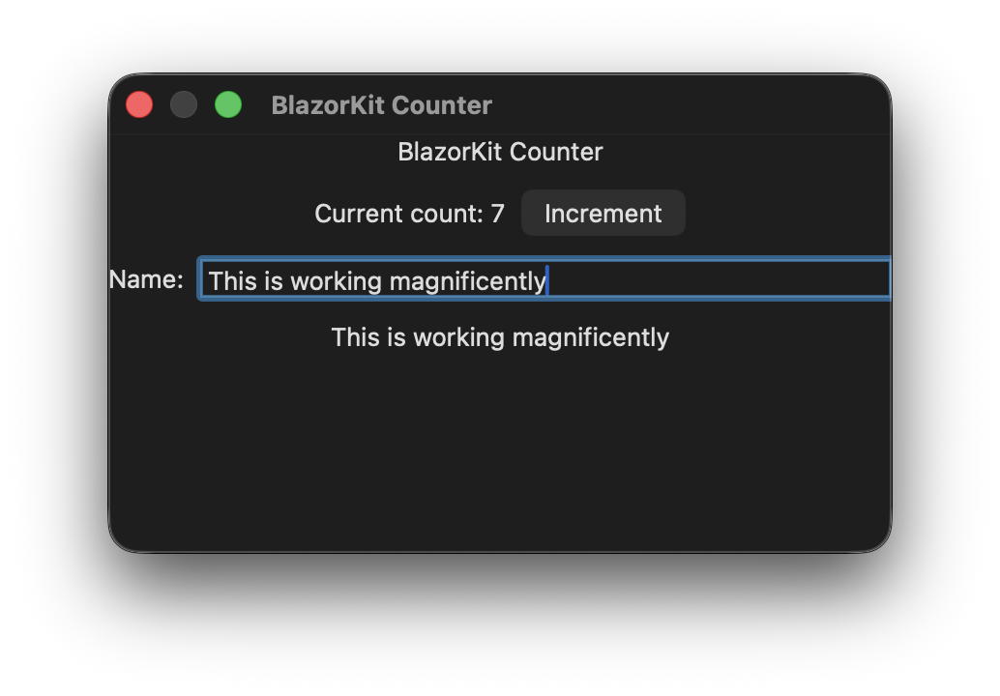

# BlazorKit

Project to build macOS applications using Blazor with a special AppKit-based Renderer. Inspired by the Flutter+Blazor demo (By Steve Sanderson demonstrated in NDC Oslo 2019) and Blazor-Binding projects.

## Install

Add the package to a .NET 10 macOS project:

```bash
dotnet add package BlazorKit
```

> [!NOTE]
> Supports only .NET 10 and above.

## Project template

Install the project template package and create a native macOS starter app:

```bash
dotnet new install BlazorKit.Templates
dotnet new blazorkit -n MyApp
cd MyApp
dotnet run
```

> [!NOTE]
> Requires macOS workload to be installed. Run `dotnet workload install macos` to install it. 

The template creates a minimal counter app targeting .NET 10 and macOS 15 or later. For different library version, pass the version explicitly with `--blazorkit-version`.

## Demo



The below code is the Blazor markup for the above macOS app.

```razor
@using BlazorKit.Components
@using AppKit

<NSScrollView HasVerticalScroller="true">
    <NSStackView Orientation="@NSUserInterfaceLayoutOrientation.Vertical" Spacing="12">
        <NSTextField StringValue="BlazorKit Counter" IsEditable="false" IsBordered="false" DrawsBackground="false" />
        <NSStackView Orientation="@NSUserInterfaceLayoutOrientation.Horizontal" Spacing="8">
            <NSTextField StringValue="@($"Current count: {currentCount}")" IsEditable="false" IsBordered="false" DrawsBackground="false" />
            <NSButton Title="Increment" Activated="Increment" />
        </NSStackView>
        <NSStackView Orientation="@NSUserInterfaceLayoutOrientation.Horizontal" Spacing="8">
            <NSTextField StringValue="Name:" IsEditable="false" IsBordered="false" DrawsBackground="false" />
            <NSTextField @bind-StringValue="name" IsEditable="true" IsBordered="true" />
        </NSStackView>
        <NSTextField StringValue="@name" IsEditable="false" IsBordered="false" DrawsBackground="false" />
    </NSStackView>
</NSScrollView>

@code {
    private int currentCount;
    private string? name;

    private void Increment()
    {
        currentCount++;
    }
}
```
